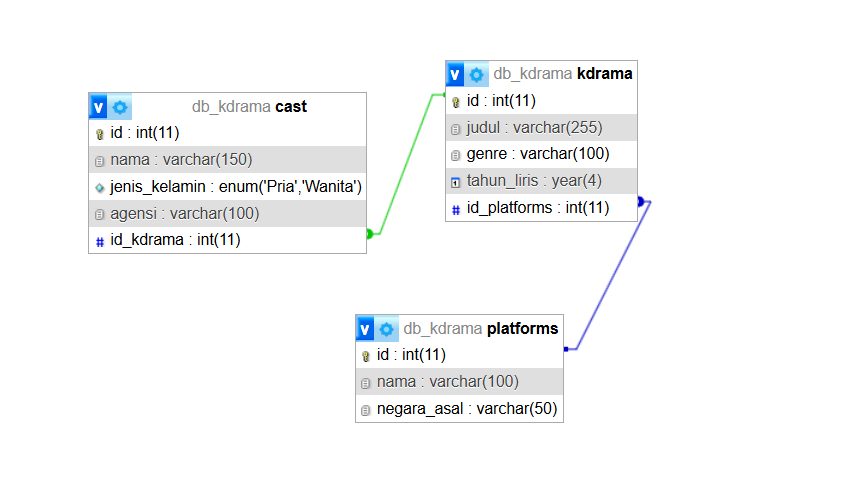

Saya Julia Rahmawati dengan NIM 2400742 mengerjakan TP 7 dalam mata kuliah Desain Pemrograman Berorientasi Berorientasi Objek untuk keberkahan-Nya, maka saya tidak akan melakukan kecurangan seperti yang telah di spesifikasikan Aamiin.

#### Tema Website
tema dari website ini adalah Manajemen Data Korea Drama, di mana pengguna dapat:
1. Menambahkan, mengedit, dan mengahapus data dari K-Dramanya.
2. Mengatur atau menambahkan cast(pemain) yang berperan di dalam K-Drama nya.
3. Lalu ada Platform tempat dimana K-Drama tayang (misalnya Netflix, disney, wetv, viu, dll).
Relasi antar tabel :
1. K-Drama memiliki relasi dengan Platform, dimana setiap K-Drama atau setiap judul memiliki platform tayang nya.
2. Cast memiliki relasi dengan K-Drama, dimana setiap K-Drama memiliki pemain nya.

#### Database

Struktur database ini di buat untuk merepresentasikan sistem manajemen data K-Drama, yang terdiri dari 3 entitas utama yaitu:
1. Platform (tempat tayangan K-Drama )
2. Kdrama (data utama dari setiap drama)
3. Cast (aktor/aktris yang berperan di masing masing K-Drama)
###### 1. platforms 
menyimpan data tentang platform streaming tempat K-Drama ditayangkan. di dalam kelas in terdpaat 3 atribut yaitu, id(tipe data INT(PK)), nama(varchar), negara_asal(varchar)
###### 2. kdrama
menyimpan informasi tentang drama korea yang di kelola dalam sistem. didalam kelas ini terdapat 5 atribut yitu, id(INT(PK)), judul(varchar), genre(varchar), tahun_liris(year), id_platform(INT(FK)).
###### 3. cast
menyimpan data pemeran yang bermain di dalam sebuah k-drama. di dalam kelas ini terdapat 5 atribut yaitu, id(INT(PK)), nama(varchar), jenis_kelamin(varchar), agensi(varchar), id_kdrama(INT(FK))

#### Flow Code
1. Database Connection (db.php)
   berisi konfigurasi koneksi ke database menggunakan PDO agar lebih aman.
2. Class
   terdapat 3 class yang terdiri dari :
   1. Platforms.php (mengelola data platform) 
   2. Kdramas.php (mengelola data K-Drama, termasuk relasi ke Platform)
   3. Cast.php (mengelola data cast, termasuk relasi ke K-Drama)
   Semua class menggunakan metode :
   1. getAll (mengambul semua data)
   2. getById (mengambil data berdasarkan ID)
   3. create (menambhkan data baru)
   4. update (mengubah data)
   5. delete (menghapus data berdasarkan ID)
3. View
   1. cast.php
      => menampilkan daftar semua Cast.
      => terdapat tombol ADD, Update, dan Delete
      => data diambil dari getAll yang sudah JOIN dengan K-Drama
   2. kdramas.php
      => menampilkan semua K-drama dengan judul, genre, dan platform tayang
      => data berasal dari getAll yang menggabungkan nama platform
      => terdapat tombol ADD, Update, dan Delete
   3. platforms.php
      => menampilkan semua platform
      => data di dambil dari getAll
      => terdapat tombol ADD, Update, dan Delete
4. Halam CRUD
   setiap entitas memiliki file terpisah untuk tiap operasinya :
   1. Cast > add_cast.php > update_cast.php > delete_cast.php
   2. K-Drama > add_kdrama.php > edit_kdrama.php > delete_kdrama.php
   3. Platform > add_platform.php > edit_platform.php > delete_platform.php
   Alur kerjanya :
    1. View menampilkan tombol Add, update, delete.
    2. ketika tombol di klik maka akan di akrahkan ke flir CRUD yang sesuai dengan ?          page=add_cast dst)
    3. file CRUD akan memanggil class terkait, memproses data POST dari Form,                 menjalankan method create(), update(), delete(), terakhir kembali ke halamview         setelah operasi selesai
5. Validasi dan Error Handling
   => Input dari form divalidasi(contoh field wajib di isi)
   => pesan error ditampilkan langsung di halaman.
#### Screen Record
